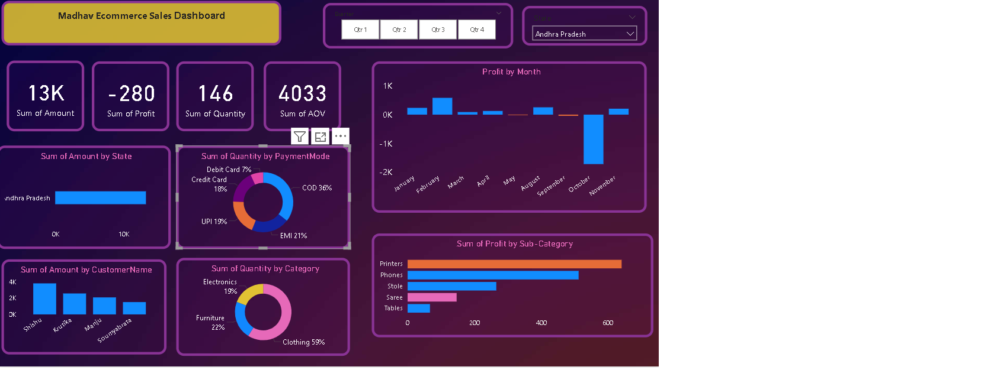

 Data Analyst Portfolio

## 👨‍💻 About Me
I am a data analyst skilled in SQL, Python, and Power BI, focused on extracting insights from data and solving business problems.

## 📊 Projects

### 1. E-commerce Sales Analysis (Python)
- Analyzed customer purchasing patterns
- Identified top-selling products and revenue trends
- Tools: Python, Pandas

### 2. Madhav E-commerce Dashboard (Power BI)
- Built interactive dashboard
- Visualized sales and customer insights
- 

  ### 3. Coffee Shop Sales Dashboard (Power BI)

- Built an interactive dashboard to analyze coffee shop sales performance
- Tracked key KPIs such as Total Sales, Total Orders, and Total Quantity Sold
- Analyzed sales trends over time (daily and monthly patterns)
- Identified top-performing product categories and items
- Compared weekday vs weekend sales performance
- Analyzed store location-wise sales distribution
- Identified peak sales hours using heatmap visualization

*Tools Used:* Power BI

## 🛠 Skills
- SQL
- Python (Pandas)
- Power BI
- Data Analysis

## 📫 Contact
- Email: shivampatil98363@gmail.com
